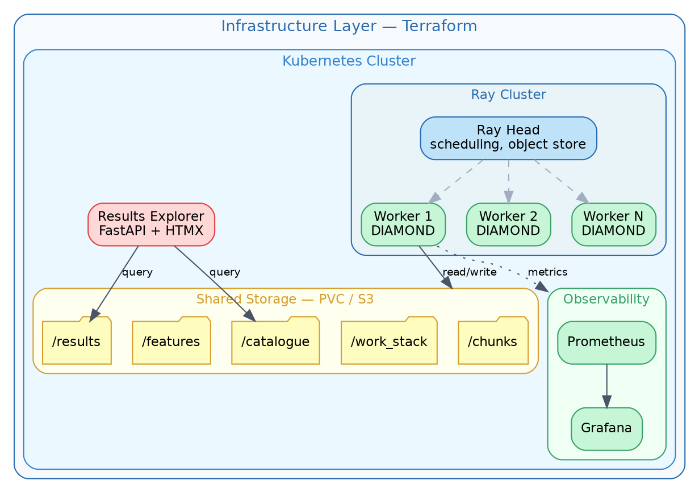
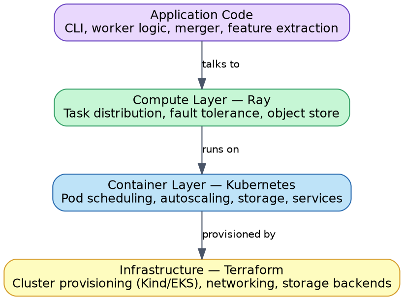
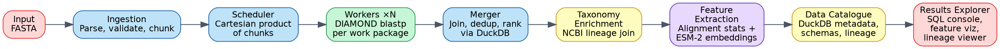
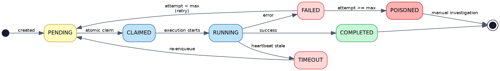

# `distributed-alignment` — Technical Design Document (TDD)

> **Document ID**: DA-TDD-001  
> **Version**: 3.0  
> **Status**: Approved  
> **Author**: Jonny  
> **Date**: April 2026  
> **Traces to**: DA-URD-001 (User Requirements Document)  

---

## 1. System Overview

`distributed-alignment` is a fault-tolerant orchestration layer for large-scale protein sequence alignment. It decomposes DIAMOND BLAST searches into independent work packages, distributes them across elastic workers, aggregates results, enriches them with taxonomic data, and produces ML-ready feature tables — with observability and infrastructure as code throughout.

### 1.1 Design Principles

These five principles inform the technical decisions throughout the system:

1. **No single point of failure.** Following DIAMOND's distributed-memory parallelisation approach, workers are peers. There's no coordinator process that could become a bottleneck or take the system down if it fails. Work is distributed through atomic operations on shared state.

2. **Idempotency everywhere.** Every operation — chunking, alignment, merging, feature extraction — produces the same output given the same input, and is safe to re-run. This matters because in a distributed system, retries are inevitable, and you need to be confident that retrying a failed operation won't produce different or duplicated results.

3. **Data contracts at boundaries.** Each pipeline stage defines an explicit input and output schema (Parquet + Pydantic). Violations are caught at the boundary between stages rather than surfacing as confusing errors downstream.

4. **Observability throughout.** Metrics, structured logging, and dashboards are built into the system from the start rather than bolted on afterwards. Operating a distributed pipeline without visibility into what it's doing is a recipe for debugging in the dark.

5. **Layered infrastructure.** Kubernetes manages containers, Ray manages compute tasks, and Terraform manages infrastructure provisioning. Each layer has a single responsibility, and the application code interacts only with Ray — it doesn't need to know whether it's running on a local Docker setup or a cloud K8s cluster.

---

## 2. Architecture

### 2.1 High-Level Architecture



### 2.2 Infrastructure Layering



The system uses three tools at three levels of abstraction:

**Terraform** provisions the underlying infrastructure: the Kubernetes cluster (Kind for local dev, EKS/GKE for cloud), storage volumes, networking, and the container registry.

**Kubernetes** manages the runtime environment: Ray head and worker pod deployments with autoscaling, the observability stack (Prometheus, Grafana) via Helm charts, shared storage via PersistentVolumeClaims, and the results explorer web application.

**Ray** manages the compute work: distributing alignment tasks across workers, handling task-level fault tolerance, scaling worker count based on queue depth, and providing an object store for intermediate data.

In practice, Ray runs on top of K8s via the KubeRay operator. K8s decides where containers run; Ray decides which container handles which alignment task. The application code only interacts with Ray's API, so the same pipeline code runs identically in local development (docker-compose with Ray in local mode) and on a production K8s cluster.

### 2.3 Data Flow



---

## 3. Component Specifications

### 3.1 Ingestion & Chunking (`distributed_alignment.ingest`)

**Traces to**: FR-1.1 through FR-1.6

**Input**: One or more FASTA files containing protein sequences.

**Validation** (Pydantic model):
```python
class ProteinSequence(BaseModel):
    id: str                          # Sequence identifier from FASTA header
    description: str                 # Full FASTA header line
    sequence: str                    # Amino acid sequence
    length: int                      # Computed, validated > 0
    
    @field_validator("sequence")
    def validate_amino_acids(cls, v):
        invalid = set(v.upper()) - VALID_AMINO_ACIDS
        if invalid:
            raise ValueError(f"Invalid amino acid characters: {invalid}")
        return v.upper()
```

**Chunking strategy**: Deterministic hash-based assignment.

Each sequence is assigned to a chunk via `chunk_id = hash(sequence_id) % num_chunks`. This guarantees reproducibility (same input always produces the same chunks regardless of file ordering), supports incremental processing (adding new sequences only affects the chunks they hash into), and gives approximately uniform distribution across chunks.

The trade-off vs. sequential chunking is slightly less predictable chunk sizes, but reproducibility matters more here — it means you can re-run the pipeline on the same input and get byte-identical chunks, which is important for verifying that results are correct.

**Output**: Per chunk, a Parquet file with enforced schema:
```
chunk_{chunk_id}.parquet
├── chunk_id: string
├── sequence_id: string
├── description: string
├── sequence: string
├── length: int32
└── content_hash: string (SHA-256 of sequence)
```

**Manifest** (JSON):
```json
{
    "run_id": "run_20260404_143022",
    "input_files": ["proteins.fasta"],
    "total_sequences": 10000,
    "num_chunks": 10,
    "chunk_size_target": 1000,
    "chunks": [
        {
            "chunk_id": "q000",
            "num_sequences": 1023,
            "parquet_path": "chunks/queries/chunk_q000.parquet",
            "content_checksum": "sha256:abcdef..."
        }
    ],
    "created_at": "2026-04-04T14:30:22Z",
    "chunking_strategy": "deterministic_hash"
}
```

**Technical patterns**: generator-based streaming parser (never loads the entire FASTA into memory), Pydantic validation at parse time, content-addressable chunk naming.

### 3.2 Work Scheduler (`distributed_alignment.scheduler`)

**Traces to**: FR-2.1, FR-2.2, FR-2.5, FR-2.6, FR-3.1 through FR-3.5

**Work package generation**: Given Q query chunks and R reference chunks, generate Q × R work packages. Each is an independent unit: "align query chunk i against reference chunk j."

**State machine**:



Every state transition is logged as an audit event:
```json
{
    "event": "state_transition",
    "package_id": "wp_q003_r007",
    "from_state": "RUNNING",
    "to_state": "FAILED",
    "worker_id": "worker-abc123",
    "attempt": 2,
    "reason": "diamond_exit_code_137_oom",
    "timestamp": "2026-04-04T14:35:00Z"
}
```

**Work package** (stored as JSON):
```json
{
    "package_id": "wp_q003_r007",
    "query_chunk_id": "q003",
    "ref_chunk_id": "r007",
    "state": "PENDING",
    "claimed_by": null,
    "claimed_at": null,
    "heartbeat_at": null,
    "started_at": null,
    "completed_at": null,
    "attempt": 0,
    "max_attempts": 3,
    "error_history": []
}
```

**Atomic claim mechanism**: Two implementations behind a common protocol interface:

1. **Filesystem backend** (local dev, HPC with shared filesystem): `os.rename()` from `pending/` to `running/` — atomic on POSIX. A worker scans `pending/`, attempts a rename; if it succeeds, the package is claimed. If another worker got there first, the rename fails and the worker tries the next package.

2. **Object store backend** (cloud): S3 conditional PUT with ETag/version check. Same semantics, different mechanism.

Both implement the `WorkStack` protocol:
```python
class WorkStack(Protocol):
    def claim(self, worker_id: str) -> WorkPackage | None: ...
    def complete(self, package_id: str, result_path: str) -> None: ...
    def fail(self, package_id: str, error: str) -> None: ...
    def heartbeat(self, package_id: str) -> None: ...
    def reap_stale(self, timeout_seconds: int) -> list[str]: ...
    def pending_count(self) -> int: ...
    def status(self) -> dict[str, int]: ...
```

This interface also means that a message broker backend (Redis, SQS) could be added without changing any application code — see ADR-001 for the rationale behind starting with the file-based approach.

**Heartbeat & reaper**: Workers update `heartbeat_at` every 30 seconds while processing. A reaper (background thread in any worker, or standalone process) scans `running/` for packages where `now - heartbeat_at > timeout`, and moves timed-out packages back to `pending/` with their attempt counter incremented. Packages exceeding `max_attempts` go to `poisoned/` for manual investigation.

### 3.3 Worker (`distributed_alignment.worker`)

**Traces to**: FR-2.3, FR-2.4, FR-2.6, FR-3.1, FR-3.4

**Worker lifecycle**:
1. Claim next work package (atomic)
2. Fetch query + reference chunks to local disk
3. Execute DIAMOND as a subprocess
4. Parse tabular output → Arrow RecordBatch
5. Write results as Parquet to shared results directory
6. Mark package as COMPLETED
7. Loop

**DIAMOND execution**:
```python
result = subprocess.run(
    [
        self.diamond_binary, "blastp",
        "--db", ref_chunk_db,
        "--query", query_chunk_fasta,
        "--out", output_path,
        "--outfmt", "6",
        "--threads", str(self.threads),
        *self.extra_args,
    ],
    timeout=self.timeout,
    capture_output=True,
    check=False,
)
```

Exit code handling: 0 → success; 137 → OOM killed (log, fail with suggestion to use a larger instance); other non-zero → log stderr, fail with error detail.

**Ray integration**:
```python
@ray.remote(num_cpus=4, memory=8 * 1024**3)
class AlignmentWorker:
    def __init__(self, config: WorkerConfig):
        self.config = config
        self.work_stack = create_work_stack(config.backend)
    
    def run_one(self) -> WorkResult | None:
        package = self.work_stack.claim(self.worker_id)
        if package is None:
            return None
        # ... execute alignment ...
        return WorkResult(package_id=package.package_id, ...)
```

Workers are Ray actors. Ray handles placement on K8s pods, restart on failure, and resource management.

### 3.4 Result Merger (`distributed_alignment.merge`)

**Traces to**: FR-4.1 through FR-4.4

When all work packages for a given query chunk are complete (all R reference chunks processed), the merger activates for that query chunk — this is the "join" step from DIAMOND's architecture.

**Implementation** — DuckDB SQL on Parquet:

```sql
WITH ranked AS (
    SELECT
        *,
        ROW_NUMBER() OVER (
            PARTITION BY query_id 
            ORDER BY evalue ASC, bitscore DESC
        ) AS global_rank
    FROM read_parquet('results/q003_r*.parquet')
)
SELECT * FROM ranked
WHERE global_rank <= {top_n}
ORDER BY query_id, global_rank
```

**Output schema** (data contract):
```
merged_{query_chunk_id}.parquet
├── query_id: string
├── subject_id: string
├── percent_identity: float64
├── alignment_length: int32
├── mismatches: int32
├── gap_opens: int32
├── query_start: int32
├── query_end: int32
├── subject_start: int32
├── subject_end: int32
├── evalue: float64
├── bitscore: float64
├── global_rank: int32
├── query_chunk_id: string
└── ref_chunk_id: string
```

### 3.5 Taxonomic Enrichment (`distributed_alignment.taxonomy`)

**Traces to**: FR-5.1 through FR-5.3

**Data source**: NCBI taxonomy dump (`taxdump.tar.gz`) — specifically `names.dml` (taxon ID to name), `nodes.dml` (taxon ID to parent and rank), and `prot.accession2taxid.gz` (protein accession to taxon ID).

**Process**: Parse NCBI taxonomy into DuckDB (one-time, cached), join merged results on `subject_id` → accession → taxon ID, walk the tree to extract full lineage, then compute per-query taxonomic profiles:

```sql
SELECT 
    query_id,
    phylum,
    COUNT(*) AS hit_count,
    AVG(percent_identity) AS mean_identity,
    MIN(evalue) AS best_evalue
FROM enriched_hits
GROUP BY query_id, phylum
```

**Output**: Enriched Parquet with taxonomy columns appended (taxon_id, species, genus, family, order, class, phylum, kingdom).

This step transforms raw alignment output into something biologically meaningful — "this protein has homologs across 12 phyla" tells a researcher something useful. It also represents a core data integration pattern: joining results from one system (DIAMOND) with a reference dataset (NCBI taxonomy) from a completely different source.

### 3.6 Feature Engineering (`distributed_alignment.features`)

**Traces to**: FR-6.1 through FR-6.5

Two feature streams feed into one output table:

**Stream A — Alignment-derived features** (one row per query sequence):

| Feature | Computation | Biological Signal |
|---|---|---|
| `hit_count` | Count of significant hits | Conservation / novelty |
| `mean_percent_identity` | Mean % identity across hits | Evolutionary distance |
| `max_percent_identity` | Best hit identity | Closest homolog |
| `mean_evalue_log10` | Mean log10(e-value) | Statistical confidence |
| `mean_alignment_length` | Mean alignment length | Domain coverage |
| `std_alignment_length` | Std dev of alignment length | Structural variability |
| `best_hit_query_coverage` | alignment_length / query_length for best hit | Annotation confidence |
| `taxonomic_entropy` | Shannon entropy of phylum distribution | Ecological breadth |
| `num_phyla` | Distinct phyla in hits | Taxonomic reach |
| `num_kingdoms` | Distinct kingdoms in hits | Deep conservation signal |

**Stream B — Protein language model embeddings**: Pre-computed ESM-2 embeddings that capture sequence-level structural and functional properties. For the demo dataset, these are pre-computed using the `esm` package or downloaded for known UniRef sequences. Stored as Parquet with `sequence_id` and a 320-dimensional embedding vector.

**Combined output**:
```
features_v1.parquet
├── sequence_id: string
├── [Stream A: 10 alignment-derived features]
├── esm2_embedding: list<float32>[320]
├── feature_version: string
├── run_id: string
└── created_at: timestamp
```

The feature table is positioned as one input stream to an ML pipeline — the system provides the data engineering, not the model itself. The exploratory notebook shows that the features are sensible (distributions, correlations, UMAP clustering) and discusses what downstream models could consume them (protein function prediction, taxonomic classification, novelty detection).

Feature schemas are versioned via the `feature_version` column. If features are added or changed, the version increments, so it's always possible to reconstruct which features a given model was trained on.

### 3.7 Data Catalogue (`distributed_alignment.catalogue`)

**Traces to**: FR-8.1 through FR-8.3

A DuckDB metadata store (`catalogue.duckdb`) tracking datasets, lineage, and pipeline runs:

```sql
CREATE TABLE datasets (
    dataset_id TEXT PRIMARY KEY,
    dataset_type TEXT,       -- 'chunk', 'merged', 'enriched', 'features'
    path TEXT,
    schema_version TEXT,
    num_rows INTEGER,
    size_bytes INTEGER,
    content_checksum TEXT,
    created_at TIMESTAMP,
    created_by_run TEXT,
    parameters JSON
);

CREATE TABLE lineage (
    child_dataset_id TEXT,
    parent_dataset_id TEXT,
    relationship TEXT,       -- 'chunked_from', 'aligned_from', etc.
    PRIMARY KEY (child_dataset_id, parent_dataset_id)
);

CREATE TABLE runs (
    run_id TEXT PRIMARY KEY,
    started_at TIMESTAMP,
    completed_at TIMESTAMP,
    status TEXT,
    config JSON,
    metrics JSON
);
```

Lineage can be queried recursively to trace any output back to its inputs:
```sql
WITH RECURSIVE ancestry AS (
    SELECT child_dataset_id, parent_dataset_id, relationship, 1 AS depth
    FROM lineage WHERE child_dataset_id = 'features_v1_run001'
    UNION ALL
    SELECT l.child_dataset_id, l.parent_dataset_id, l.relationship, a.depth + 1
    FROM lineage l JOIN ancestry a ON l.child_dataset_id = a.parent_dataset_id
    WHERE a.depth < 10
)
SELECT * FROM ancestry ORDER BY depth;
```

### 3.8 Observability (`distributed_alignment.observability`)

**Traces to**: FR-7.1 through FR-7.4

**Structured logging** via structlog — every log entry is JSON with `timestamp`, `level`, `component`, `worker_id`, `run_id`, `package_id`, and event-specific fields. The combination of `run_id` + `package_id` + `worker_id` allows tracing any result back to its processing context.

**Prometheus metrics**:

| Metric | Type | Description |
|---|---|---|
| `da_packages_total` | gauge (by state) | Work packages by state |
| `da_package_duration_seconds` | histogram | Time per work package |
| `da_sequences_processed_total` | counter | Total sequences aligned |
| `da_hits_found_total` | counter | Total alignment hits |
| `da_worker_heartbeat_age_seconds` | gauge (by worker) | Time since last heartbeat |
| `da_worker_count` | gauge | Active workers |
| `da_errors_total` | counter (by type) | Errors by category |
| `da_diamond_exit_code` | counter (by code) | DIAMOND exit codes |

**Grafana dashboard**: Pre-configured JSON with panels for pipeline progress, worker health, resource usage, cost estimate, and error analysis.

**Cost estimation**: Each work package records duration and resource usage. After a run, a cost report estimates cloud compute cost (e.g., `total_cpu_hours × c5.xlarge_rate`) and cost-per-million-sequences.

### 3.9 Configuration Management (`distributed_alignment.config`)

**Traces to**: NFR-4.5

Layered config via Pydantic Settings, with precedence: defaults → `distributed_alignment.toml` → environment variables (`DA_CHUNK_SIZE=10000`) → CLI arguments.

```python
class DistributedAlignmentConfig(BaseSettings):
    model_config = SettingsConfigDict(
        env_prefix="DA_",
        env_nested_delimiter="__",
        toml_file="distributed_alignment.toml",
    )
    
    chunk_size: int = 50_000
    chunking_strategy: Literal["deterministic_hash", "sequential"] = "deterministic_hash"
    diamond_binary: str = "diamond"
    diamond_sensitivity: Literal["fast", "sensitive", "very-sensitive", "ultra-sensitive"] = "very-sensitive"
    diamond_max_target_seqs: int = 50
    diamond_timeout: int = 3600
    num_workers: int = 4
    heartbeat_interval: int = 30
    heartbeat_timeout: int = 120
    max_attempts: int = 3
    work_dir: Path = Path("./work")
    results_dir: Path = Path("./results")
    features_dir: Path = Path("./features")
    catalogue_path: Path = Path("./catalogue.duckdb")
    log_level: str = "INFO"
    metrics_port: int = 9090
    enable_cost_tracking: bool = True
    cost_per_cpu_hour: float = 0.0464
```

### 3.10 Results Explorer (`distributed_alignment.explorer`)

**Traces to**: FR-9.1 through FR-9.3

A FastAPI + HTMX web application with five views:

1. **Run Browser** (`/runs`): Pipeline runs with status, duration, and dataset sizes.
2. **SQL Console** (`/query`): Free-form SQL against the DuckDB catalogue and results, pre-loaded with example queries.
3. **Feature Explorer** (`/features`): Interactive Plotly visualisations — feature distributions, correlation matrices, UMAP projections.
4. **Lineage Viewer** (`/lineage/{dataset_id}`): Trace any dataset back to its inputs as a visual DAG.
5. **Pipeline Monitor** (`/monitor`): Auto-refreshing view of pipeline progress during a run (HTMX polling).

---

## 4. Data Contracts

Every pipeline stage boundary has an explicit schema contract. A violation is a hard failure.

| Stage Boundary | Format | Enforcement |
|---|---|---|
| Ingestion → Chunks | Parquet | PyArrow schema + Pydantic per-record |
| Scheduler → Work Packages | JSON | Pydantic `WorkPackage` model |
| Workers → Raw Results | Parquet | PyArrow schema matching DIAMOND output spec |
| Merger → Merged Results | Parquet | Pydantic `MergedHit` model |
| Taxonomy → Enriched Results | Parquet | Extended schema with taxonomy columns |
| Features → Feature Table | Parquet | Pydantic `FeatureRow` model, version embedded |

Each contract has unit tests that verify both valid and invalid data handling.

---

## 5. Infrastructure as Code

### 5.1 Terraform Structure

```
terraform/
├── environments/
│   ├── local/              # Kind cluster + local storage
│   └── aws/                # EKS + S3 (stretch goal)
├── modules/
│   ├── k8s-cluster/
│   ├── storage/
│   ├── ray-cluster/        # KubeRay operator
│   └── observability/      # Prometheus + Grafana via Helm
└── README.md
```

### 5.2 Local Development Stack

```yaml
# docker-compose.yml
services:
  ray-head:
    build: .
    command: ray start --head --dashboard-host=0.0.0.0
    ports:
      - "8265:8265"
    volumes:
      - shared-data:/data

  ray-worker:
    build: .
    command: ray start --address=ray-head:6379
    deploy:
      replicas: 4
    volumes:
      - shared-data:/data

  prometheus:
    image: prom/prometheus
    volumes:
      - ./observability/prometheus.yml:/etc/prometheus/prometheus.yml
    ports:
      - "9090:9090"

  grafana:
    image: grafana/grafana
    volumes:
      - ./observability/grafana/:/etc/grafana/provisioning/
    ports:
      - "3000:3000"

  explorer:
    build: .
    command: distributed-alignment explorer --port 8000
    ports:
      - "8000:8000"
    volumes:
      - shared-data:/data

volumes:
  shared-data:
```

### 5.3 Kubernetes Manifests

```
k8s/
├── namespace.yaml
├── storage/
│   └── pvc.yaml
├── ray/
│   ├── ray-cluster.yaml        # KubeRay CRD
│   └── ray-autoscaler.yaml
├── observability/
│   ├── prometheus-values.yaml
│   └── grafana-values.yaml
├── explorer/
│   ├── deployment.yaml
│   └── service.yaml
└── kustomization.yaml
```

### 5.4 Dependency Management

Python dependencies are managed with `uv` — both for local development (`uv sync` creates a virtualenv from `pyproject.toml`) and inside Docker images (`uv pip install` in the Dockerfile). `uv` replaces pip/pip-tools for dependency resolution and is significantly faster, which noticeably improves Docker build times.

The Dockerfile handles the runtime environment: Python version, DIAMOND binary, and system libraries. `uv` handles the Python package layer on top of that.

---

## 6. Testing Strategy

### 6.1 Test Pyramid

| Level | Scope | Tools | Target |
|---|---|---|---|
| **Unit** | Chunking logic, state transitions, schema validation, feature calculations | pytest | >80% core modules |
| **Property** | Invariants: chunking determinism, sequence preservation, state machine validity | hypothesis | All state machines and transformations |
| **Integration** | Full pipeline on test dataset; multi-worker coordination; fault recovery | pytest + subprocess + docker-compose | Happy path + 3 failure modes |
| **Contract** | Schema validation at every stage boundary | Pydantic + PyArrow | 100% of boundaries |
| **Chaos** | Kill workers, corrupt files, inject OOM | Custom harness | 5 failure scenarios |

### 6.2 Key Test Scenarios

1. **Chunking round-trip**: chunk → reassemble → diff against original. Zero loss, zero duplication.
2. **Chunking determinism**: same input twice → identical output, byte-for-byte.
3. **Atomic claim**: 10 workers, 5 packages. Each package claimed exactly once.
4. **Worker death recovery**: kill worker mid-package (SIGKILL), verify another worker completes it.
5. **Idempotent re-run**: run pipeline, re-run with identical inputs. Output unchanged.
6. **Schema violation**: malformed Parquet into the merger → hard failure with clear error.
7. **Merge correctness**: hand-computed expected results vs. merger output.
8. **Feature determinism**: same enriched results → same feature table, byte-for-byte.

### 6.3 CI/CD Pipeline (GitHub Actions)

```yaml
name: CI
on: [push, pull_request]

jobs:
  quality:
    runs-on: ubuntu-latest
    steps:
      - uses: actions/checkout@v4
      - uses: actions/setup-python@v5
        with: { python-version: "3.11" }
      - run: pip install -e ".[dev]"
      - run: ruff check src/ tests/
      - run: ruff format --check src/ tests/
      - run: mypy src/ --strict

  test:
    runs-on: ubuntu-latest
    steps:
      - uses: actions/checkout@v4
      - uses: actions/setup-python@v5
        with: { python-version: "3.11" }
      - run: pip install -e ".[dev]"
      - run: pytest tests/ -v --cov=distributed_alignment --cov-report=xml
      - uses: codecov/codecov-action@v4

  docker:
    runs-on: ubuntu-latest
    steps:
      - uses: actions/checkout@v4
      - uses: docker/build-push-action@v5
        with:
          push: false
          tags: distributed-alignment:latest

  integration:
    needs: [quality, test, docker]
    runs-on: ubuntu-latest
    steps:
      - uses: actions/checkout@v4
      - run: docker-compose up -d
      - run: ./scripts/run_integration_test.sh
      - run: docker-compose down
```

---

## 7. Architecture Decision Records

### ADR-001: File-based work distribution vs. message broker

**Status**: Accepted  
**Context**: Work packages need to be distributed to workers. Options considered: message broker (RabbitMQ, Redis, SQS), file-based stack with atomic operations, database-backed queue.  
**Decision**: File-based stack with atomic rename (filesystem) or conditional PUT (object store).  
**Rationale**: This mirrors DIAMOND's own approach, which is proven at massive scale. It has no infrastructure dependencies and works on shared filesystems (HPC), object stores (cloud), and local disk (dev). Each alignment job takes minutes, so the microsecond overhead of an atomic file rename for claiming a package is negligible — the coordination layer is never the bottleneck.  
**Trade-offs**: Lower throughput than a message broker for claim operations. If the system needed to distribute many small fast tasks (sub-second), a broker would be the better choice. The `WorkStack` protocol interface supports adding a Redis or SQS backend without changing application code.

### ADR-002: Deterministic hash-based chunking

**Status**: Accepted  
**Context**: Input sequences must be partitioned into chunks. Options: sequential split, deterministic hash-based, content-aware (e.g., by taxonomy).  
**Decision**: Deterministic hash (`hash(sequence_id) % num_chunks`).  
**Rationale**: Same input always produces the same chunks, regardless of file ordering. This makes the pipeline reproducible and also supports incremental processing — adding new sequences only affects the chunks they hash into.  
**Trade-offs**: Chunk sizes are approximately but not exactly equal. Sequential splitting would give exact sizes but breaks reproducibility if input order changes.

### ADR-003: Ray on Kubernetes for compute orchestration

**Status**: Accepted  
**Context**: Need to distribute alignment tasks across workers with fault tolerance and elastic scaling.  
**Decision**: Ray as the compute layer, deployed on Kubernetes via KubeRay. Terraform provisions the K8s cluster and associated infrastructure.  
**Rationale**: Ray is Python-native, handles task-level fault tolerance, and supports elastic scaling. K8s provides the container runtime and autoscaling. Terraform codifies the infrastructure. Each tool has a single responsibility, and the application code only talks to Ray.  
**Trade-offs**: More complex local setup than pure multiprocessing. Mitigated by docker-compose providing a K8s-free local development experience with Ray in local mode.

### ADR-004: Parquet with Arrow as the universal data format

**Status**: Accepted  
**Context**: Need a format for chunks, results, and features. Options: CSV/TSV, Parquet, HDF5, Arrow IPC.  
**Decision**: Parquet everywhere, with Arrow as the in-memory representation.  
**Rationale**: Columnar compression (10-30x smaller than TSV for alignment results), built-in schema enforcement, predicate pushdown for queries, and native DuckDB integration.  
**Trade-offs**: Not human-readable. Mitigated by the explorer UI and DuckDB CLI for interactive inspection.

### ADR-005: DuckDB for analytics, not Spark

**Status**: Accepted  
**Context**: Need SQL capability for merging results, computing features, and interactive queries.  
**Decision**: DuckDB — an embedded, zero-infrastructure SQL engine that operates directly on Parquet files.  
**Rationale**: For the data volumes in this system (millions of rows, not billions), DuckDB is simpler and faster than Spark. No JVM, no cluster setup, no YARN. The merge step and feature extraction run in seconds. The SQL is standard, and the data format is Parquet, so switching to Spark or BigQuery for larger volumes would be straightforward.  
**Trade-offs**: Won't scale to multi-terabyte datasets without rearchitecting the merge layer.

### ADR-006: Idempotency as a design principle

**Status**: Accepted  
**Context**: Distributed systems fail, and operations need to be safely retryable.  
**Decision**: Every pipeline operation produces identical output given identical input, enforced by content-addressable storage and deterministic computation.  
**Rationale**: If a worker dies and its task is retried, the result must be the same. If the whole pipeline is re-run, the output must be the same. This is what makes fault tolerance actually work — retries are always safe.  
**Trade-offs**: Requires more careful design (deterministic hashing, content-addressed outputs) than a simpler "just run it" approach. Tested explicitly in the test suite.

---

## 8. Repository Structure

```
distributed-alignment/
├── README.md
├── pyproject.toml
├── distributed_alignment.toml
├── Dockerfile
├── docker-compose.yml
├── .github/workflows/ci.yml
│
├── docs/
│   ├── 01-user-requirements.md
│   ├── 02-technical-design.md
│   ├── 03-product-requirements.md
│   ├── data-contracts.md
│   ├── diagrams/
│   │   ├── *.mmd                     # Mermaid sources
│   │   └── png/                      # Rendered PNGs
│   └── adr/
│       ├── 001-file-based-work-distribution.md
│       ├── 002-chunking-strategy.md
│       ├── 003-ray-on-kubernetes.md
│       ├── 004-parquet-arrow-format.md
│       ├── 005-duckdb-not-spark.md
│       └── 006-idempotency-principle.md
│
├── terraform/
│   ├── environments/
│   │   ├── local/
│   │   └── aws/
│   └── modules/
│       ├── k8s-cluster/
│       ├── storage/
│       ├── ray-cluster/
│       └── observability/
│
├── k8s/
│   ├── namespace.yaml
│   ├── ray/
│   ├── observability/
│   ├── explorer/
│   └── kustomization.yaml
│
├── src/distributed_alignment/
│   ├── __init__.py
│   ├── config.py                     # Pydantic Settings configuration
│   ├── models.py                     # All Pydantic models (data contracts)
│   ├── ingest/
│   │   ├── __init__.py
│   │   ├── fasta_parser.py           # Streaming FASTA parser
│   │   └── chunker.py               # Deterministic chunking
│   ├── scheduler/
│   │   ├── __init__.py
│   │   ├── protocols.py              # WorkStack protocol
│   │   ├── filesystem_backend.py     # POSIX atomic rename
│   │   ├── s3_backend.py            # Conditional PUT (stretch)
│   │   └── reaper.py                # Heartbeat timeout detector
│   ├── worker/
│   │   ├── __init__.py
│   │   ├── diamond_wrapper.py        # Subprocess management
│   │   ├── runner.py                # Worker main loop
│   │   └── ray_actor.py            # Ray remote wrapper
│   ├── merge/
│   │   ├── __init__.py
│   │   └── merger.py                # DuckDB-based join + dedup
│   ├── taxonomy/
│   │   ├── __init__.py
│   │   ├── ncbi_loader.py           # Parse NCBI taxdump
│   │   └── enricher.py             # Join hits with taxonomy
│   ├── features/
│   │   ├── __init__.py
│   │   ├── alignment_features.py     # Stream A: alignment stats
│   │   ├── embedding_features.py     # Stream B: ESM-2 integration
│   │   └── combiner.py             # Join streams into feature table
│   ├── catalogue/
│   │   ├── __init__.py
│   │   └── store.py                 # DuckDB metadata catalogue
│   ├── observability/
│   │   ├── __init__.py
│   │   ├── logging.py               # structlog configuration
│   │   └── metrics.py              # Prometheus metrics
│   ├── explorer/
│   │   ├── __init__.py
│   │   ├── app.py                   # FastAPI application
│   │   ├── templates/               # HTMX templates
│   │   └── static/                  # CSS, JS
│   └── cli.py                       # Typer CLI
│
├── tests/
│   ├── conftest.py
│   ├── test_chunker.py
│   ├── test_work_stack.py
│   ├── test_worker.py
│   ├── test_merger.py
│   ├── test_taxonomy.py
│   ├── test_features.py
│   ├── test_catalogue.py
│   ├── test_contracts.py
│   └── test_integration.py
│
├── observability/
│   ├── prometheus.yml
│   └── grafana/
│
├── notebooks/
│   └── feature_exploration.ipynb
│
├── scripts/
│   ├── download_test_data.sh
│   ├── download_taxonomy.sh
│   └── run_integration_test.sh
│
└── demo/
    └── README.md
```

---

## 9. Implementation Phases

### Phase 1: Core Pipeline (MVP)

Ingest → chunk → schedule → align (single worker) → merge → Parquet output. Includes streaming FASTA parser, deterministic chunker, filesystem work stack, single-threaded DIAMOND worker, DuckDB merger, Pydantic data contracts, structlog, pytest suite, and pyproject.toml packaging.

### Phase 2: Fault Tolerance & Distribution

Multi-worker execution with fault recovery. Heartbeat mechanism, timeout reaper, retry with backoff, poison queue. Ray integration, Docker packaging, docker-compose with N workers, chaos tests, Prometheus metrics, Grafana dashboard, GitHub Actions CI/CD.

### Phase 3: Enrichment & Features

NCBI taxonomy enrichment, alignment feature extraction (Stream A), ESM-2 embedding integration (Stream B), combined feature table with schema versioning, DuckDB data catalogue, lineage tracking, exploratory Jupyter notebook.

### Phase 4: Infrastructure & Explorer

Terraform configs (local Kind cluster), K8s manifests with KubeRay, FastAPI + HTMX results explorer with SQL console and feature visualisations, cost estimation.

### Phase 5: Polish & Demo

README, ADRs, demo video showing the full workflow including fault recovery, data contracts documentation, final CI green.
